Project 2: Verify and Performance Evaluation of Mutual Exclusive
Services

**Team Member**: Yifan Xu/ Longhao Gao

Project background:
==================================================================================================================

As an academic project in the Advanced Operating Systems Course, this
project requires an implementation of different distributed mutual
exclusion algorithm on the Internet. The upper applications will invoke
the critical section provided by lower layer algorithms.

Automatic correctness verification of the algorithm is also required as
part of the project.

Besides, algorithm performance also need to be handled automatically.

The mandatory two algorithms are Lamport and Roucairol & Carvalho’s, we
also implemented the Ricart-Agrawala as bonus.

Project Requirements:
====================================================================================================================

Implementation Environment: Multiple nodes in lab computer

Realize main use case:

1.  Application enter critical section by invoke enterCS() interface
    provided by different algorithms

2.  Application leave critical section by invoke leaveCS()interface
    provided by different algorithms

3.  Implement algorithm lamport and Roucairol & Carvalho’s algorithm
    class to provide interface

4.  Application’s behavior according to the config file with is 10-20ms
    delay and execution time in cs.

5.  All the nodes in full-mesh topology, only one FIFO connections
    allowed between each node.

6.  The verification of the algorithm correctness should be
    automatically

7.  The algorithm performance should be provided for different config
    file variable.

Project Design
=============================================================================================================

We have both system design and design model. The system design is for
the purpose of better cooperation. The Design model is for the purpose
of future reuse or refactor.

System Architect
---------------------------------------------------------------------------------------------------------------

The project was designed with Layered architectural style. The
application, algorithm and FIFO channel were decomposed into layers.
Each layer provides interface to upper layer and use the lower layer’s
services.

The bottom layer is the transport layer which provides both TCP and SCTP
connection. In order to provide FIFO for TCP connection, we forced to
flush the TCP buffered each time we send a message.

The Message Service Layer provide not only String based message delivery
to specific node, but also embedded the Logical and Vector clock inside
it. The clock will tick automatically once new messages are sent or
received. The Lock service could be utilized by upper layers.

The algorithm layer is in charge of orchestrate the entering of critical
section. It’s the core part of this project. We implemented three
different types of algorithms.

The application layer is in charge of simulator the behavior of enter
and leaving critical section. Besides, both the correction verification
subsystem and performance measure subsystem located on this layer
because the application layer provides them with all kinds of timer log.

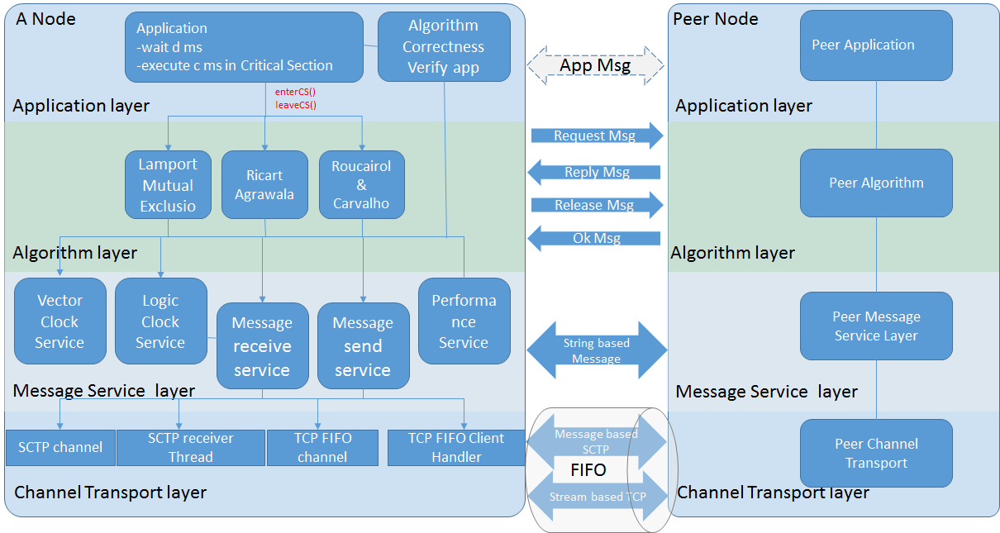{width="4.359375546806649in"
height="2.319410542432196in"}

Design Model
-----------------------------------------------------------------------------------------------------------

GRASP (General Responsibility Assignment Software Pattern) is the main
principle we use to create our main classes.

Controller: it’s the entry of the main program, it represents the
overall mutual exclusion system to the outside.

Information expert: Node. Node provides the network topology and config
information to the system. It is generated by the parser class which can
parse the config file.

Creator: MessageFactory & Algorithms Factory create the message and
algorithm as needed.

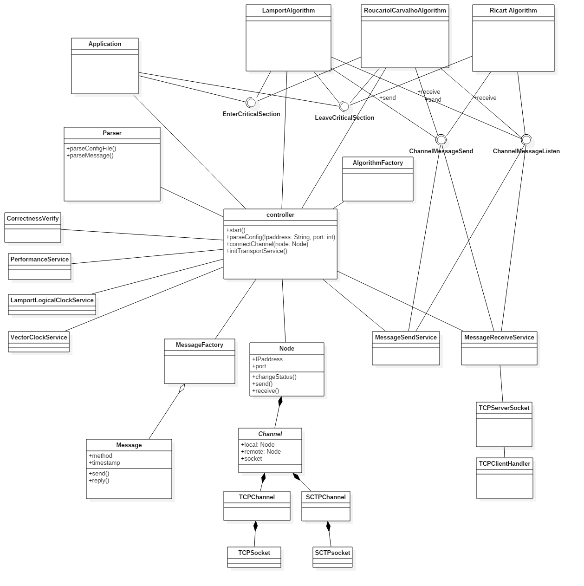{width="4.109375546806649in"
height="4.109375546806649in"}

Project Implementation
=====================================================================================================================

Node Topology:
-------------------------------------------------------------------------------------------------------------

All the nodes full-mesh connected:

  ------------- ------ ------ ------ ------ ------ ------ ------ ------ ------ ------
  node id       0      1      2      3      4      5      6      7      8      9
  node number   dc01   dc02   dc03   dc04   dc05   dc06   dc07   dc08   dc09   dc10
  port number   5040   5041   5042   5043   5043   5043   5040   5041   5042   5043
  ------------- ------ ------ ------ ------ ------ ------ ------ ------ ------ ------

Operation System version:
------------------------------------------------------------------------------------------------------------------------

Ubuntu 16.04 LTS amd64

Memory:
------------------------------------------------------------------------------------------------------

> RES -- Resident size (kb): 37024
>
> Memory usage by the application is recorded using command line **top**
> on dc01.utdallas.edu.
>
> PID USER PR NI VIRT RES SHR S %CPU %MEM TIME+ COMMAND
>
> 27421 lxg1515+ 20 0 2509412 37024 12152 S 2.0 3.6 0:00.65 java

Compiler:
--------------------------------------------------------------------------------------------------------

> openjdk version “1.8.0\_91”
>
> java-8-openjdk-amd64

Host application:
----------------------------------------------------------------------------------------------------------------

> We Implement the mutual exclusion service among n processes using two
> different distributed mutual exclusion algorithms: Lamport’s and
> Roucairol & Carvalho’s in this application.
>
> It could be launched using command line “**bash Launcher\_host.sh”**.
>
> **Parameters in Host as follows:**

1.  configfileName: it tells the application the path of config.txt

2.  algorithm Name: this application provides users two different
    > distributed mutual exclusion algorithms:

> ***lamport*** :Lamport’s
>
> ***rouc***: Roucairol & Carvalho’s

1.  Transport: this application provides users two type of transport
    > layers: ***tcp*** and ***sctp***.

Correctness application:
-----------------------------------------------------------------------------------------------------------------------

> Correctness is used to test the correctness of our implementation of
> two different distributed mutual exclusion algorithms in Host
> application. Meanwhile, it could compute message complexity, response
> time and system throughput by analysing the output file from **Host**
> application.
>
> It could be launched using command line “**bash
> launcher\_correctness.sh**”.
>
> **Parameters in Host as follows:**

1.  configfileName: it tells the application the path of config.txt

Performance Analysis
===================================================================================================================

Compare the performance of the two different mutual exclusion\
algorithms with respect to message complexity, response time and system
throughput using experiments for various values of system parameters,
namely n, d and c. Display the results of your\
experiments by plotting appropriate graphs. Note that each point in the
graph should be obtained\
by averaging over multiple runs.

Raw data table
-------------------------------------------------------------------------------------------------------------

  ------------------------- ----------------- ------- ------- -------------------- ------------------- -------------------
  Algorithm                 number of nodes   d(ms)   c(ms)   Message Complexity   response time(ms)   System Throughput
  lamport                   3                 20      10      5.95                 54.32               35.34
  lamport                   5                 20      10      11.925               69.62               49.475
  lamport                   5                 20      20      11.92                86.08               39.24
  lamport                   5                 20      40      11.94                148.62              23.73
  lamport                   5                 40      10      11.97                63.16               42.23
  lamport                   5                 60      10      11.98                55.495              38.69
  lamport                   5                 40      20      11.95                77.11               36.185
  lamport                   10                20      10      26.94                91.51               80.72
  lamport                   10                40      20      26.875               147.925             47.535
  Roucairol & Carvalho’s.   3                 20      10      2.23                 25.26               52.265
  Roucairol & Carvalho’s.   5                 20      10      6.02                 49.81               55.895
  Roucairol & Carvalho’s.   5                 20      20      11.98                55.54               38.69
  Roucairol & Carvalho’s.   5                 20      40      7.45                 141.3               23.52
  Roucairol & Carvalho’s.   5                 40      10      5.64                 38.14               53.69
  Roucairol & Carvalho’s.   5                 60      10      5.39                 30.23               47.83
  Roucairol & Carvalho’s.   5                 40      20      6.465                57.39               40.63
  Roucairol & Carvalho’s.   10                20      10      15.675               80.035              84.515
  Roucairol & Carvalho’s.   10                40      20      16.49                140.62              48.275
  ------------------------- ----------------- ------- ------- -------------------- ------------------- -------------------

Comparison Figures
-----------------------------------------------------------------------------------------------------------------

### Results varied on different number of nodes

  ---------------------------------------------------------------------------------- --------
  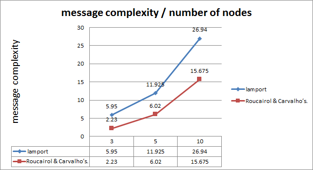{width="4.010416666666667in" height="2.1805555555555554in"}   d=20ms
                                                                                     
                                                                                     c=10ms
  ---------------------------------------------------------------------------------- --------

  ------------------------------------------------------------------------ --------
  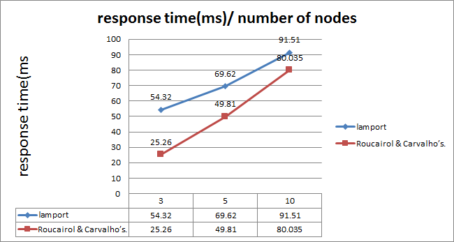{width="4.03125in" height="2.1527777777777777in"}   d=20ms
                                                                           
                                                                           c=10ms
  ------------------------------------------------------------------------ --------

  ----------------------------------------------------------------------- --------
  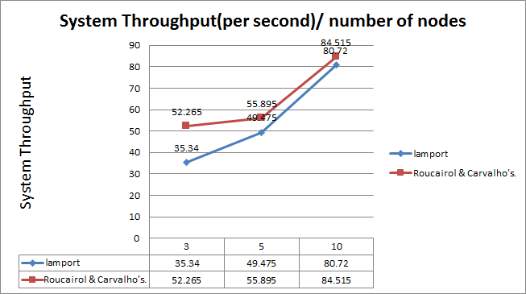{width="4.536458880139983in" height="2.21875in"}   d=20ms
                                                                          
                                                                          c=10ms
  ----------------------------------------------------------------------- --------

### Results varied on different execution times

  ---------------------------------------------------------- -------------
  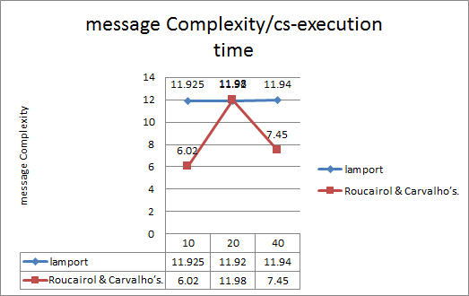{width="4.5625in" height="2.875in"}   N = 5 nodes
                                                             
                                                             D =20ms
  ---------------------------------------------------------- -------------

  ------------------------------------------------------------------------ -------------
  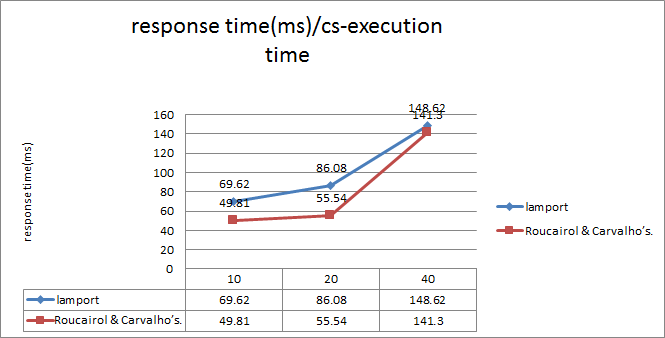{width="4.53125in" height="2.3055555555555554in"}   N = 5 nodes
                                                                           
                                                                           D =20ms
  ------------------------------------------------------------------------ -------------

  ---------------------------------------------------------------------------------- -------------
  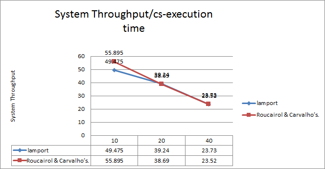{width="4.489583333333333in" height="2.3333333333333335in"}   N = 5 nodes
                                                                                     
                                                                                     D =20ms
  ---------------------------------------------------------------------------------- -------------

### 

### Results varied on different delay in execution

  -------------------------------------------------------------------- ------------
  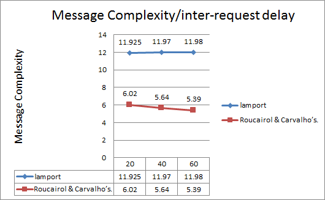{width="4.5in" height="2.7777777777777777in"}   n= 5 nodes
                                                                       
                                                                       c= 10 ms
  -------------------------------------------------------------------- ------------

  ------------------------------------------------------------------------ ------------
  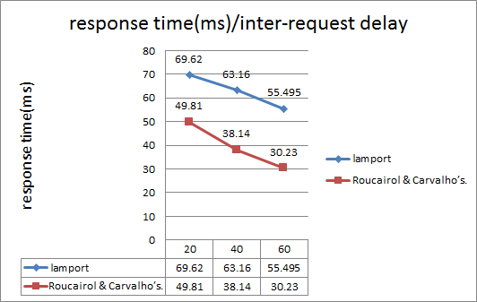{width="4.71875in" height="2.986111111111111in"}   n= 5 nodes
                                                                           
                                                                           c= 10 ms
  ------------------------------------------------------------------------ ------------

  ----------------------------------------------------------------------------------- ------------
  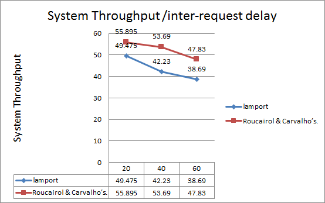{width="4.697916666666667in" height="2.9444444444444446in"}   n= 5 nodes
                                                                                      
                                                                                      c= 10 ms
  ----------------------------------------------------------------------------------- ------------

Summary
======================================================================================================

Beside the algorithm themselves, this project requires lot of knowledge
of network socket programming, concurrent programming and
object-oriented design knowledge.

The automatic correctness verification part requires ability to apply
theory into real word.

The performance measurement requires lots of data. We tried to make a
simulator class automatically run of the different variable and generate
all the data at one time. However, the correctness of the simulator
fails once it runs the second time. So we have to change back to manual
performance log collection.
